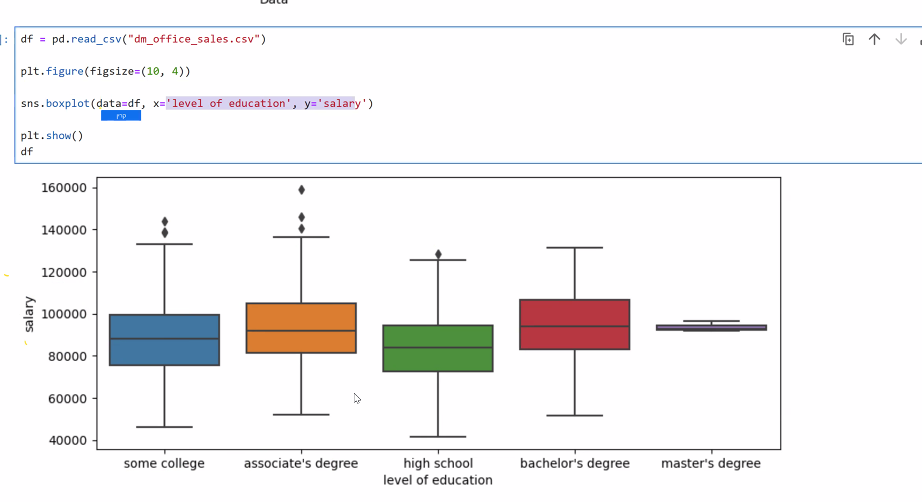

# dataScience-Seaborn-Lec12-20-APR-25
Seaborn - intro - presentation 25
* sns.scatterplot(data=df,x='salary', y='sales',hue='salary',palette='Spectral')
  * hue= component can be from other value from the df and not from the x,y values
  * palette= template of colors
  * s=size
  * alpha= transparency 0-1
* sns.displot(data=df,x='salary',bin=30,kde=True)= histogram graph
  * sns.kdplot(data=df,x='salary')=histogram line only
* sns.countplot -like histogram.
  * vs hist: hist unite groups.
  * can display subgroups (of same/other data) within the container group
* sns.boxplot: display many statistic in 1 graph:
